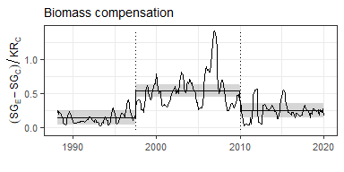

# Appendix S3 - Biomass analysis
Renata Diaz

# Background

This is a modified subset of Appendix S3 from the article “Maintenance
of community function through compensation breaks down over time in a
desert rodent community” by Renata Diaz and S. K. Morgan Ernest, now
published in *Ecology* (Diaz and Ernest 2022).

# Compensation

Compensation refers to the degree to which the remaining species on
kangaroo rat removal plots absorb resources made available via kangaroo
rat removal ([Figure 1](#fig-plot)). We fit a generalized least squares
(of the form *compensation ~ timeperiod*; note that “timeperiod” is
coded as “oera” throughout) using the `gls` function from the R package
`nlme` (Pinheiro, Bates, and R Core Team 2023). Because values from
monthly censuses within each time period are subject to temporal
autocorrelation, we included a continuous autoregressive temporal
autocorrelation structure of order 1 (using the `CORCAR1` function). We
compared this model to models fit without the autocorrelation structure
and without the time period term using AIC. The model with both the time
period term and the autocorrelation structure was the best-fitting model
via AIC ([Table 1](#tbl-comp)), and we used this model to calculate
estimates and contrasts using the package `emmeans` (Lenth et al. 2023)
([Table 2](#tbl-ests), [Table 3](#tbl-contrasts)).

# Data analysis

## Data preparation

The following code downloads the data and prepares the `compensation`
data frame for analysis.

If needed, install the `soar` package:

<details>
<summary>Code</summary>

``` r
remotes::install_github('diazrenata/soar')
```

</details>

Data can be downloaded directly from the Portal data repository:

<details>
<summary>Code</summary>

``` r
plotl <- get_plot_totals(currency = "biomass")

plot_types <- list_plot_types() %>% filter(plot_type == "EE")
```

</details>

For interpretability, translating the era and treatment “names” as RMD
coded them for analysis to the corresponding dates:

<details>
<summary>Code</summary>

``` r
oera_df <- data.frame(
  oera = c("a_pre_pb", "b_pre_reorg", "c_post_reorg"),
  `Timeperiod` = c("1988-1997", "1997-2010", "2010-2020")
)

oplot_df <- data.frame(oplottype = c("CC", "EE"),
                       `Treatment` = c("Control", "Exclosure"))

contrasts_df <- data.frame(
  contrast = c(
    "a_pre_pb - b_pre_reorg",
    "a_pre_pb - c_post_reorg",
    "b_pre_reorg - c_post_reorg"
  ),
  Comparison = c(
    "1988-1997 - 1997-2010",
    "1988-1997 - 2010-2020",
    "1997-2010 - 2010-2020"
  )
)
```

</details>

Because there are 5 exclosure plots and 4 control plots in these data,
we remove 1 exclosure plot to achieve a balanced design. From the 5
possible exclosures to remove, we randomly select 1 using the seed 1977
(the year the Portal Project was initiated).

<details>
<summary>Code</summary>

``` r
plot_types <- plot_types  %>% 
  filter(plot_type == "EE")

set.seed(1977) 
remove_plot <- sample(plot_types$plot, 1, F) # results in removing plot 19

plotl <- plotl %>%
  filter(plot != remove_plot)
```

</details>

Finally, take treatment-level means and calculate the compensation
variable:

<details>
<summary>Code</summary>

``` r
# Treatment-level means:
treatl <- plots_to_treatment_means(plotl) 

# Format column types
treatl <- treatl %>%
  mutate(censusdate = as.Date(censusdate),
         oera = ordered(oera),
         oplottype = ordered(oplottype))

compensation <- get_compensation(treatl)
```

</details>

## GLS model

The following code fits the GLS models:

<details>
<summary>Code</summary>

``` r
comp_mean_gls <-
  gls(smgran_comp ~ oera,
      correlation = corCAR1(form = ~ period),
      data = compensation)

comp_mean_gls_notime <-
  gls(smgran_comp ~ 1,
      correlation = corCAR1(form = ~ period),
      data = compensation)

comp_mean_gls_noautoc <-
  gls(smgran_comp ~ oera, data = compensation)

comp_mean_null <- gls(smgran_comp ~ 1, data = compensation)
```

</details>

Model comparison via AIC:

<details>
<summary>Code</summary>

``` r
compensation_comparison <- data.frame(
  `Model specification` = c(
    "intercept + timeperiod + autocorrelation",
    "intercept + autocorrelation",
    "intercept + timeperiod",
    "intercept"
  ),
  AIC = c(
    AIC(comp_mean_gls),
    AIC(comp_mean_gls_notime),
    AIC(comp_mean_gls_noautoc),
    AIC(comp_mean_null)
  )
)
```

</details>

Calculate estimates:

<details>
<summary>Code</summary>

``` r
comp_mean_gls_emmeans <- emmeans(comp_mean_gls, specs = ~ oera)

compensation_estimates <- oera_df %>%
  left_join(as.data.frame(comp_mean_gls_emmeans)) %>%
  select(-oera)
```

</details>

Calculate contrasts:

<details>
<summary>Code</summary>

``` r
compensation_contrasts <-contrasts_df %>%
  left_join(as.data.frame(pairs(comp_mean_gls_emmeans))) %>%
  mutate(p.value = round(p.value, digits = 4)) %>%
  select(-contrast)
```

</details>

# Results

## Tables

<div id="tbl-comp">

| Model.specification                      |        AIC |
|:-----------------------------------------|-----------:|
| intercept + timeperiod + autocorrelation | -17.623354 |
| intercept + autocorrelation              |  -3.297103 |
| intercept + timeperiod                   |  92.184205 |
| intercept                                | 207.804481 |

Table 1: Comparisons for GLS on compensation.

</div>

<details>
<summary>Code</summary>

``` r
knitr::kable(compensation_estimates)
```

</details>

<div id="tbl-ests">

| Timeperiod |    emmean |        SE |       df |  lower.CL |  upper.CL |
|:-----------|----------:|----------:|---------:|----------:|----------:|
| 1988-1997  | 0.1435663 | 0.0511419 | 39.40368 | 0.0401558 | 0.2469767 |
| 1997-2010  | 0.5366915 | 0.0452745 | 42.04303 | 0.4453267 | 0.6280564 |
| 2010-2020  | 0.2441751 | 0.0517205 | 41.30488 | 0.1397469 | 0.3486034 |

Table 2: Estimates for GLS on compensation.

</div>

<details>
<summary>Code</summary>

``` r
knitr::kable(compensation_contrasts)
```

</details>

<div id="tbl-contrasts">

| Comparison            |   estimate |        SE |       df |   t.ratio | p.value |
|:----------------------|-----------:|----------:|---------:|----------:|--------:|
| 1988-1997 - 1997-2010 | -0.3931253 | 0.0673811 | 43.35973 | -5.834358 |  0.0000 |
| 1988-1997 - 2010-2020 | -0.1006089 | 0.0727090 | 40.49222 | -1.383719 |  0.3588 |
| 1997-2010 - 2010-2020 |  0.2925164 | 0.0678003 | 44.56438 |  4.314383 |  0.0003 |

Table 3: Contrasts for GLS on compensation.

</div>



## Figures





# References

<div id="refs" class="references csl-bib-body hanging-indent">

<div id="ref-diaz2022" class="csl-entry">

Diaz, Renata M., and S. K. Morgan Ernest. 2022. “Maintenance of
Community Function Through Compensation Breaks down over Time in a
Desert Rodent Community.” *Ecology* 103 (7): e3709.
<https://doi.org/10.1002/ecy.3709>.

</div>

<div id="ref-lenth2023" class="csl-entry">

Lenth, Russell V., Ben Bolker, Paul Buerkner, Iago Giné-Vázquez, Maxime
Herve, Maarten Jung, Jonathon Love, Fernando Miguez, Hannes Riebl, and
Henrik Singmann. 2023. “Emmeans: Estimated Marginal Means, Aka
Least-Squares Means.”

</div>

<div id="ref-pinheiro2023" class="csl-entry">

Pinheiro, José, Douglas Bates, and R Core Team. 2023. *Nlme: Linear and
Nonlinear Mixed Effects Models*.

</div>

</div>
